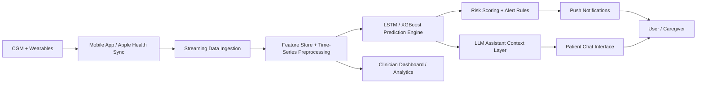

# AI in Personalized Medicine: Building the Future of Diabetes Care with Smart Wearables

This repository presents an end-to-end research and engineering portfolio for a personalized diabetes-care platform that combines continuous glucose monitoring (CGM), wearable biosensors, mobile health integration, time-series forecasting, and an LLM-based assistant. The goal is to show both academic depth and practical system thinking for MSc applications, GitHub portfolios, and research or innovation programs across the UAE and GCC.

## 1. Concept

### What the system does

The proposed system continuously collects glucose, heart rate, sleep, activity, and meal context from CGM devices, wearable sensors, and mobile health platforms such as Apple Health. It uses these signals to forecast short-term glucose trends, detect likely hypo- or hyperglycemic events, and provide personalized, natural-language guidance through an AI assistant.

### Who it helps

The primary users are people living with diabetes, especially those who benefit from frequent glucose tracking and behavioral feedback. Secondary users include caregivers, clinicians, and digital-health teams who need interpretable summaries and early warnings.

### Why it matters

Diabetes remains a major global health burden. According to the World Health Organization, more than 830 million people worldwide live with diabetes, with a large share in low- and middle-income settings where scalable, data-driven support is especially valuable. Wearables and mobile health tools create a path toward continuous, personalized, and preventive care rather than episodic intervention.

### Problem statement

Most diabetes management systems still operate in a reactive mode: they show current glucose values but provide limited foresight, weak personalization, and poor integration with lifestyle context. This creates missed opportunities for early intervention, personalized coaching, and risk reduction.

### Proposed solution

Build a hybrid AI platform that:

- predicts glucose values 30 to 60 minutes ahead using time-series models,
- adapts predictions to each user's physiological and behavioral patterns,
- sends real-time alerts for likely risk states,
- explains predictions in plain language using an LLM assistant,
- integrates with mobile ecosystems and wearable sensors for practical deployment.

### Key innovations

- Personalized temporal modeling that combines CGM dynamics with lifestyle features.
- A hybrid ML + LLM pipeline: numerical forecasting for risk detection and natural-language reasoning for user support.
- A deployment design that supports both cloud-assisted and privacy-sensitive on-device workflows.
- A cost-aware architecture that can be adapted for lower-resource regions through lightweight models and asynchronous syncing.

## 2. Portfolio Contents

- [Full research paper](./paper/research_paper.md)
- [Sample dataset](./data/sample_glucose_dataset.csv)
- [LSTM training pipeline](./src/train_lstm.py)
- [XGBoost baseline](./src/train_xgboost.py)
- [Preprocessing utilities](./src/preprocess.py)
- [Dependencies](./requirements.txt)

## 3. Dataset Schema

The data layer is designed around multimodal, timestamped observations:

| Field | Type | Description |
|---|---|---|
| `timestamp` | datetime | Observation time |
| `glucose_mg_dl` | float | CGM glucose reading in mg/dL |
| `heart_rate_bpm` | float | Wearable heart rate |
| `steps_5min` | int | Steps during the previous 5-minute window |
| `sleep_score` | float | Prior-night sleep quality score (0-100) |
| `meal_carbs_g` | float | Estimated grams of carbohydrate recently consumed |
| `insulin_units` | float | Delivered insulin in the relevant interval |
| `stress_score` | float | Derived wearable stress index (0-1) |
| `hour_of_day` | int | Hour extracted from timestamp |
| `day_of_week` | int | Day extracted from timestamp |
| `future_glucose_30m` | float | Prediction target 30 minutes ahead |

## 4. Data Preprocessing

The preprocessing pipeline follows a standard wearable time-series workflow:

1. Sort events by user and timestamp.
2. Resample to fixed intervals such as 5 minutes.
3. Impute missing sensor values using forward fill plus capped interpolation.
4. Remove obvious sensor artifacts and outliers.
5. Normalize numerical features with min-max scaling or z-score scaling.
6. Generate lag features such as the last 6 to 12 glucose points.
7. Add rolling summaries: mean, slope, variability, and time-in-range indicators.
8. Create the supervised target, for example glucose 30 minutes ahead.
9. Split data by time to avoid leakage.

## 5. Feature Engineering

Features are chosen to reflect both physiology and behavior:

- Recent glucose window: captures immediate trend and inertia.
- Heart rate and stress features: approximate acute exertion or physiological strain.
- Activity features: steps, active calories, workout flags.
- Sleep features: useful for daily insulin sensitivity variation and morning dynamics.
- Meal features: carbohydrate load, time since meal, estimated glycemic impact.
- Insulin features: bolus amount, basal estimate, time since last dose.
- Circadian context: hour of day and weekday.
- Rolling variability features: standard deviation, slope, and rate of change.

## 6. Mathematical Foundation

### Time-series objective

Given a multivariate sequence over a lookback window of length `T`,

`X = {x_(t-T+1), ..., x_t}`

the model predicts a future glucose value:

`y_(t+h) = f(X)`

where `h` is the forecast horizon, such as 30 minutes ahead.

### Normalization

Min-max scaling:

`x' = (x - x_min) / (x_max - x_min)`

This places features on a comparable range and stabilizes training.

### LSTM equations

For input `x_t`, hidden state `h_(t-1)`, and cell state `c_(t-1)`:

`f_t = sigma(W_f [h_(t-1), x_t] + b_f)`

`i_t = sigma(W_i [h_(t-1), x_t] + b_i)`

`g_t = tanh(W_g [h_(t-1), x_t] + b_g)`

`c_t = f_t * c_(t-1) + i_t * g_t`

`o_t = sigma(W_o [h_(t-1), x_t] + b_o)`

`h_t = o_t * tanh(c_t)`

Intuition:

- the forget gate decides what older information to keep,
- the input gate decides what new information to write,
- the cell state stores long-term temporal memory,
- the output gate controls what part of that memory is exposed.

### Loss functions

Mean Squared Error:

`MSE = (1/n) * sum((y_i - yhat_i)^2)`

Mean Absolute Error:

`MAE = (1/n) * sum(|y_i - yhat_i|)`

MSE penalizes large errors more strongly; MAE is easier to interpret in mg/dL.

### Evaluation metrics

- `RMSE = sqrt(MSE)`: average prediction error in original units.
- `MAE`: robust, interpretable absolute error.
- `R^2`: explained variance.
- Time in Range alignment: whether predicted trajectories preserve clinically useful range behavior.
- Event detection metrics: precision, recall, and F1 for hypo/hyperglycemia alerts.

## 7. Machine Learning Pipeline

### Primary model: LSTM

LSTM is used because glucose dynamics are sequential and context-dependent. It can learn delayed effects from meals, insulin, sleep, and activity better than a purely static model.

### Comparison model: XGBoost

XGBoost serves as a strong tabular baseline using engineered lag and rolling features. It is often faster to train, more interpretable with feature importance tools, and easier to deploy on limited hardware.

### Training flow

1. Load wearable and CGM records.
2. Build aligned, fixed-interval samples.
3. Create lookback windows and future targets.
4. Train LSTM and XGBoost separately.
5. Evaluate on the last chronological split.
6. Calibrate alert thresholds for clinical safety.
7. Feed predictions and context into the LLM assistant.

### Model improvement strategy

- Personalize by fine-tuning on each user's history.
- Add uncertainty estimation for safer alerts.
- Use domain adaptation to transfer across users.
- Incorporate event embeddings for meals, exercise, and medication.
- Explore transformer or foundation-model approaches after baseline stabilization.

## 8. Implementation

The code in `src/` provides a compact starter implementation:

- `preprocess.py`: reads CSV data, adds cyclical time features, scales numerical columns, and builds sequential windows.
- `train_lstm.py`: trains a PyTorch LSTM regressor for 30-minute glucose prediction.
- `train_xgboost.py`: trains an XGBoost baseline on flattened sequential features.

### Recommended project structure

```text
.
├── README.md
├── requirements.txt
├── data/
│   └── sample_glucose_dataset.csv
├── paper/
│   └── research_paper.md
└── src/
    ├── preprocess.py
    ├── train_lstm.py
    └── train_xgboost.py
```

### How to run locally

```bash
python3 -m venv .venv
source .venv/bin/activate
pip install -r requirements.txt
python src/train_lstm.py --data data/sample_glucose_dataset.csv
python src/train_xgboost.py --data data/sample_glucose_dataset.csv
```

Important note: the sample CSV is intentionally small and illustrative. Meaningful performance requires a real dataset such as OhioT1DM or institution-approved CGM streams.

## 9. LLM Assistant Module

### Role

The LLM assistant turns predictions and sensor context into explanations and practical guidance. It does not replace medical advice; it translates model outputs into understandable support.

### Responsibilities

- Explain why glucose may be rising or falling.
- Summarize recent behavior patterns.
- Answer user questions in plain language.
- Offer safe, non-prescriptive suggestions such as checking food timing, hydration, or contacting a clinician when needed.

### Prompt design

System prompt design should include:

- patient safety boundaries,
- current glucose and predicted trend,
- recent meal, activity, and sleep context,
- alert status and uncertainty,
- instruction to avoid medication dosing advice unless clinician-approved rules exist.

### Example input

```json
{
  "current_glucose": 178,
  "predicted_glucose_30m": 214,
  "trend": "rising",
  "recent_meal_carbs_g": 65,
  "steps_30m": 180,
  "sleep_score": 58,
  "alert": "high_glucose_risk"
}
```

### Example output

> Your glucose appears to be rising and may move above your target range within the next 30 minutes. A likely contributor is the recent meal combined with low recent activity and lower sleep quality. Consider checking your usual care plan, monitoring your CGM closely, and contacting your clinician if this pattern repeats or symptoms appear.

### Architecture

For a first version, simple context injection is enough:

`prediction service -> context builder -> LLM -> mobile response`

For a stronger version, use lightweight RAG:

`prediction service + patient-specific history + safety policy + education knowledge base -> LLM`

## 10. System Architecture



### Real-time vs batch

- Real-time path: streaming CGM, alert generation, chat explanations.
- Batch path: nightly retraining, trend summaries, personalization updates, clinician reporting.

### On-device vs cloud

- On-device: lower latency, better privacy, useful for basic alerting.
- Cloud: stronger model training, cross-device sync, analytics, and advanced LLM functions.
- Hybrid strategy: run safety-critical lightweight inference locally and use cloud only for heavy analytics and conversational features.

## 11. Innovation Analysis

This work is not only a prediction model; it is a personalized care framework. The main contribution is the combination of wearable-driven time-series modeling with an explanation layer designed for user trust and day-to-day usefulness.

### What is novel here

- A personalized modeling loop that updates from each user's real lifestyle patterns.
- A multimodal feature design that connects CGM values to sleep, movement, stress, meals, and insulin timing.
- A clinically aware assistant that explains trends while respecting safety constraints.
- A deployment lens shaped for GCC priorities: scalable digital health, mobile-first access, and adaptability to both high-resource hospitals and lower-resource communities.

## 12. Reflection

### Challenges

- Sensor data are messy, irregular, and often incomplete.
- Real glucose behavior depends on delayed and interacting factors.
- Accuracy alone is not enough; explanation quality and alert reliability matter too.

### Trade-offs

- Accuracy vs battery: frequent sensing and local inference consume power.
- Privacy vs performance: cloud systems can be more powerful, but protected health data must be handled carefully.
- Generalization vs personalization: cross-user models scale better, but user-specific fine-tuning is often more clinically useful.

### Lessons learned

As an ML engineer, the key lesson is that healthcare AI must optimize for trust, safety, and integration, not only benchmark performance. A strong system needs rigorous preprocessing, transparent evaluation, careful product design, and clinically informed constraints around what the AI should and should not say.

## 13. Future Work

- Add transformer-based or foundation-model forecasting.
- Integrate real HealthKit ingestion and smartwatch APIs.
- Add uncertainty-aware prediction intervals.
- Build a clinician dashboard for care teams.
- Expand to Android and cross-platform wearable ecosystems.
- Open-source the modular pipeline with synthetic demonstration data and reproducible experiments.

## 14. Selected References

1. World Health Organization. Diabetes overview. https://www.who.int/diabetes/en/
2. Marling C, Bunescu R. The OhioT1DM Dataset for Blood Glucose Level Prediction: Update 2020. https://pmc.ncbi.nlm.nih.gov/articles/PMC7881904/
3. Shao J, Liu Z, Li S, et al. Continuous Glucose Monitoring Time Series Data Analysis: A Time Series Analysis Package for Continuous Glucose Monitoring Data. https://pubmed.ncbi.nlm.nih.gov/35939283/
4. Time in range: a new parameter to evaluate blood glucose control in patients with diabetes. https://pmc.ncbi.nlm.nih.gov/articles/PMC7076978/
5. Apple Developer Documentation. HealthKit data types. https://developer.apple.com/documentation/healthkit/data-types
6. A large sensor foundation model pretrained on continuous glucose monitor data for diabetes management. https://www.nature.com/articles/s44401-025-00039-y

## 15. Positioning for MSc / Portfolio Use

This project demonstrates:

- research communication,
- mathematical clarity,
- machine learning system design,
- practical implementation ability,
- healthcare AI awareness,
- product thinking for real-world deployment.

It can be extended into a capstone, a thesis proposal, a startup prototype, or a research fellowship application focused on precision medicine and digital health.
